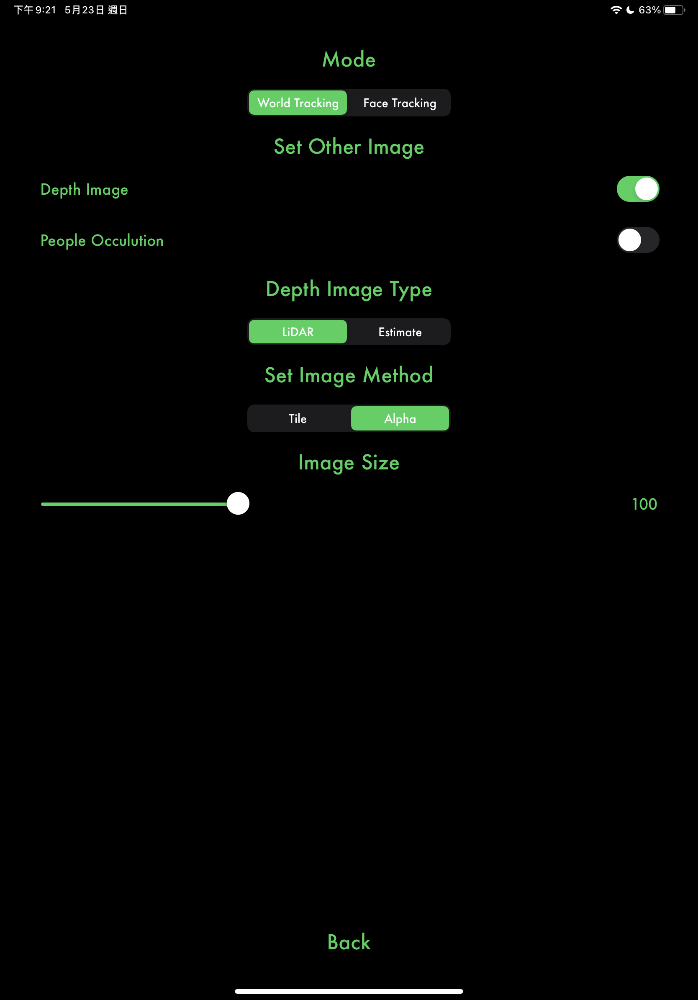

# TD-ZIGCAM

Receive information from ZIGCAM (Author: [@ToyoshiMorioka](https://github.com/ToyoshiMorioka)) via NDI to achieve local rendering and compositing on [TouchDesigner](https://derivative.ca/).

As of now, please set it like this first:

## To-do

- [ ] Use Shader to do EnvironmentMaker to save performance.
- [ ] Use Shader to do depth compositing to save video memory.
- [ ] Calculate the normal value of ScreenClick so that the new object can be rotated to the normal on the surface.
- [ ] SSAO
- [ ] Manually Add New Plane
- [ ] Image stabilization 

## Function request for ZIGCAM
- [ ] Depth greater than one (depth to hue or else).
- [ ] Add image merging mode to metadata so that TD-ZIGCAM can automatically adapt.
- [ ] The near-far of the original projection matrix is ​​too small and may need to be changed manually.
- [ ] Add the click event and click position on the APP screen to the metadata.
- [ ] Return Panel objects (polygonal coordinates) generated by ARkit in the xml structure in the metadata (To receive shadows, etc.).

---
接收ZIGCAM(作者：@ToyoshiMorioka)經由NDI的資訊來實現在TD本地端渲染以及合成。

## 待辦事項
- [ ] 用Shader來做EnvironmentMaker，以節省效能
- [ ] 用Shader來做深度合成，以節省視訊記憶體
- [ ] 求得與計算ScreenClick的法線值，以讓新增物件在表面上可以向法線旋轉
- [ ] SSAO
- [ ] 加入"手動增新平面" 功能
- [ ] 基於加速度的圖像穩定

## 對ZIGCAM的功能請求

- [ ] 大於一的深度(depth to hue or else)
- [ ] 在metadata中加入圖像合併模式，以讓TD-ZIGCAM可以自動適應
- [ ] 原始投影矩陣的near-far太小，可能要手動更改
- [ ] 在metadata中加入APP螢幕上的點擊事件與點擊位置
- [ ] 在metadata中以xml結構回傳ARkit產生的Panel平面物件(多角形座標)(用以接收陰影等等)
- [ ] 在Ipad上的多工處理

